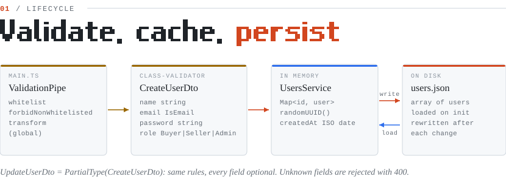
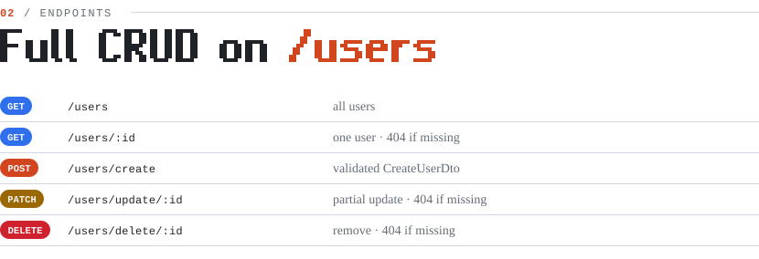

<picture>
  <source media="(prefers-color-scheme: dark)" srcset="docs/banner-dark.svg" />
  
</picture>

<picture>
  <source media="(prefers-color-scheme: dark)" srcset="docs/lifecycle-dark.svg" />
  
</picture>

<picture>
  <source media="(prefers-color-scheme: dark)" srcset="docs/endpoints-dark.svg" />
  
</picture>

---

A small learning project built with NestJS that implements full CRUD for users using file-based persistence (no database). It's designed to teach DTOs, validation pipes, and Node.js file I/O by storing user records in a JSON file (`users.json`).

## Project goals

- Learn NestJS fundamentals: controllers, services, modules, DTOs, and validation pipes.
- Practice reading and writing JSON files from Node.js for simple persistence.
- Implement safe-ish file-based CRUD (create, read, update, delete) for user records.

## Features

- Create users with validated input (`name`, `email`, `password`).
- Read all users or a single user by ID.
- Update users with partial DTOs (PATCH semantics).
- Delete users and persist the change to `users.json`.
- Lightweight, dependency-minimal API suitable for learning and experimentation.

## Tech stack

- Node.js
- NestJS
- TypeScript
- (Optional) Jest for tests (project includes `test/` folder and e2e config)

## Where data lives

All user records are stored in a JSON file named `users.json` located in the project root (next to `package.json`) or created at runtime if missing. The file shape is an array of user objects, for example:

```json
[
  {
    "id": "uuid-or-id",
    "name": "Alice",
    "email": "alice@example.com",
    "password": "hashed-or-plain",
    "role": "Admin" | "Seller" | "Buyer"
  }
]
```

Note: This project is intended for learning. Do NOT store plaintext passwords in production. Consider hashing before persisting when you extend this project.

## Quick start

Prerequisites:
- Node.js (v16+ recommended)
- npm

Install dependencies and run in dev mode:

```bash
cd um_api
npm install
npm run start:dev
```

By default Nest runs on `http://localhost:3000` unless configured otherwise.

## Available npm scripts

Check `package.json` for the exact scripts, but typical useful scripts are:

```bash
npm run start     # start production build
npm run start:dev # start in watch mode (development)
npm run build     # compile TypeScript to JavaScript
npm run test:e2e  # run e2e tests (if configured)
```

## HTTP API


Base URL: `http://localhost:3000`

### Endpoints

- `GET    /users` — Get all users
- `GET    /users/:id` — Get user by ID
- `POST   /users/create` — Create a new user
  - Body: `{ "name": string, "email": string, "password": string, "role": string }`
- `DELETE /users/delete/:id` — Delete user by ID
- `PATCH  /users/update/:id` — Update user by ID (partial update)
  - Body: any subset of user fields (e.g. `{ "name": "UpdatedName" }`)

#### Example requests (REST Client)

You can use the included `requests.http` file with the [REST Client VS Code extension](https://marketplace.visualstudio.com/items?itemName=humao.rest-client) for quick API testing. Open `requests.http` and click "Send Request" above any block.

Example request blocks:

```http
# Get all users
GET http://localhost:3000/users
Accept: application/json

###

# Get user by id
GET http://localhost:3000/users/{userId}
Accept: application/json

###

# Create user
POST http://localhost:3000/users/create
Content-Type: application/json

{
  "name": "AdminUser",
  "email": "Admin@example.com",
  "password": "Passsword123",
  "role": "Admin"
}

###

# Delete user by id
DELETE http://localhost:3000/users/delete/{userId}
Accept: application/json

###

# Update user by id
PATCH http://localhost:3000/users/update/{userId}
Content-Type: application/json

{
  "name": "UpdatedName"
}
```

## DTOs & Validation

This project uses DTOs and NestJS validation pipes to validate incoming data. Typical DTOs you'll find or implement:

- `CreateUserDto` — required fields for creating a user
- `UpdateUserDto` — a `PartialType(CreateUserDto)` for PATCH updates

Validation is handled via class-validator decorators (e.g. `@IsString()`, `@IsEmail()`, `@IsNotEmpty()`), and you can enable global validation pipes in `main.ts`.

## File I/O notes & safety

- Reads load `users.json` and returns parsed JSON.
- Writes replace the file contents with serialized JSON representing the current user array.
- For small learning projects this is OK, but watch out for race conditions in concurrent environments. Consider:
  - Using atomic write strategies (write to a temp file then rename)
  - File locking or mutex when multiple processes may write
  - Moving to a proper database for concurrent, large-scale, or secure needs

## Security notes

- This implementation is for learning. Do not use in production without strengthening security.
- Hash passwords before persisting (e.g., bcrypt) — do not store plaintext passwords.
- Add authentication (JWT or sessions) and authorization checks for protected routes.

## Testing

The repository includes a `test/` folder. To run tests, inspect `package.json` for the test scripts. Example:

```bash
npm run test
npm run test:e2e
```

Adjust commands to match the scripts present in this repo.

## Next steps / suggested improvements

- Hash passwords (bcrypt) before saving.
- Add request authentication and role-based authorization.
- Add per-request input sanitization and stronger validators.
- Replace file storage with a database (Postgres + Prisma) as you progress.
- Add logging and better error handling for file read/write failures.

## Contributing

This is a personal learning project. If you want to extend it, open a branch and create small, focused changes. Add tests for new behaviors.

## License

MIT

---

Requirements coverage:
- Create, read, update, delete users using `users.json`: Documented
- Validated input via DTOs and validation pipes: Documented
- File I/O read/write operations explained and safety notes: Documented
- Learning-focused guidance for migrating to DB and next steps: Documented

<sub>Diagrams in <code>docs/</code> are generated SVGs, drawn to match the code in this repo.</sub>
